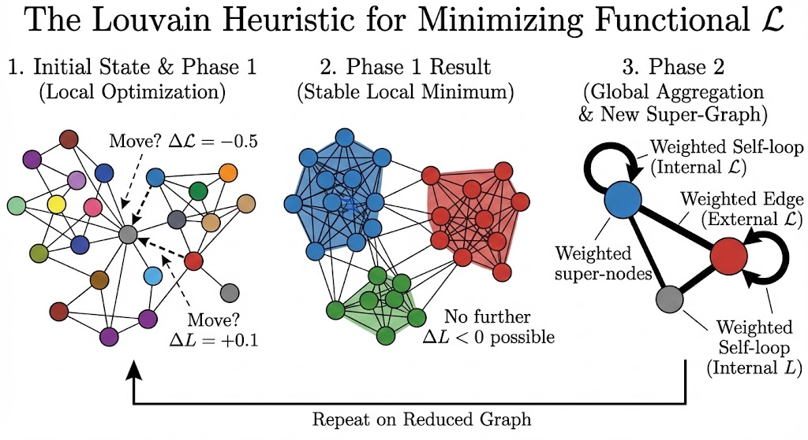
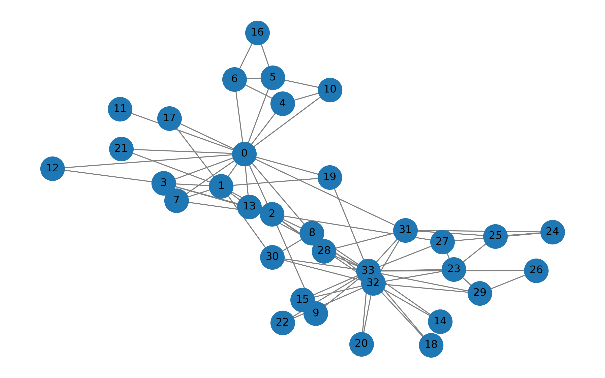
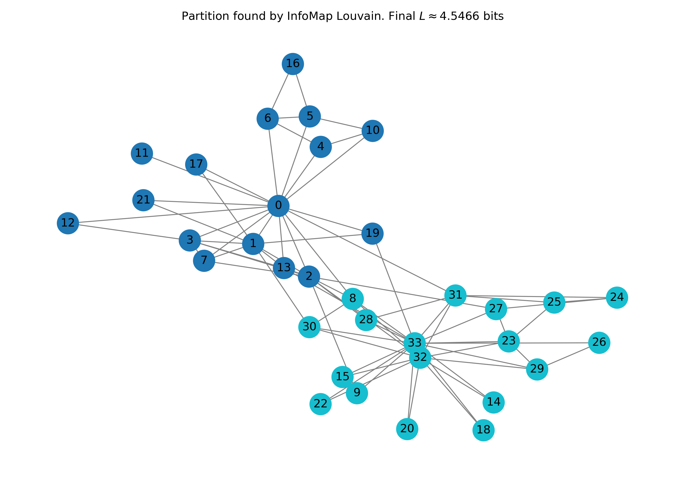
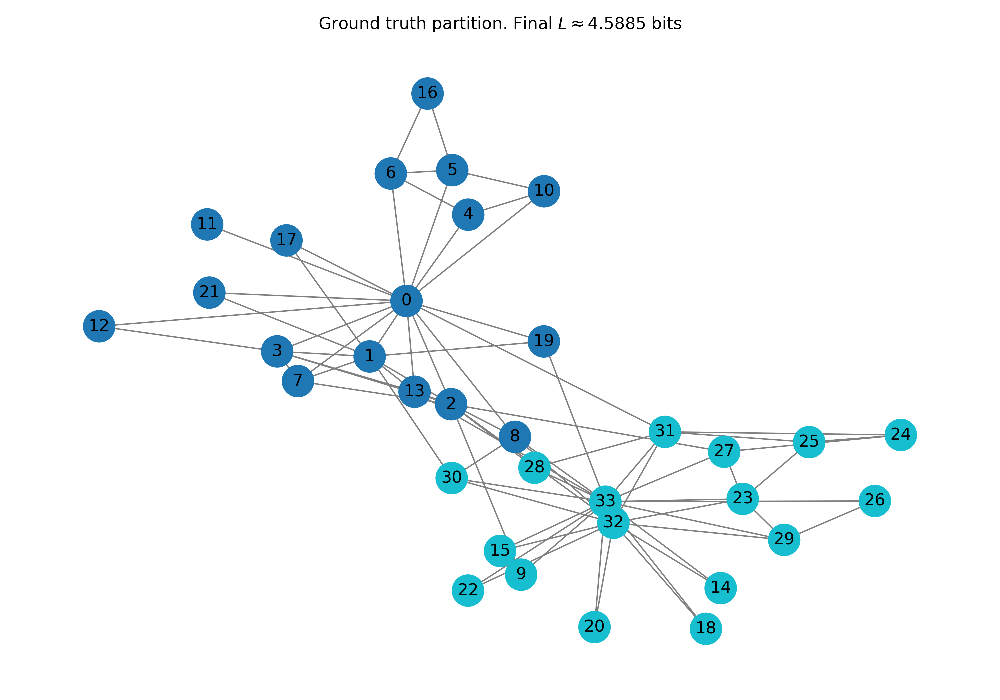
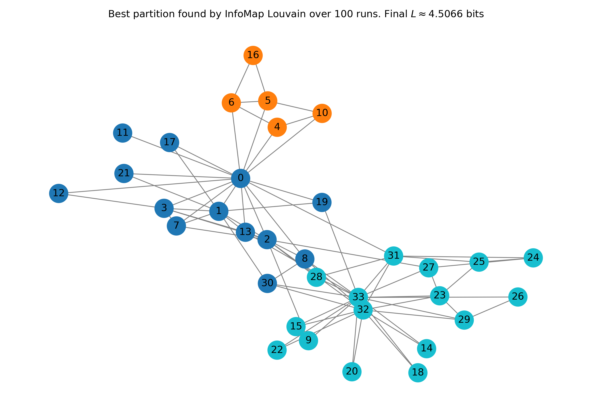
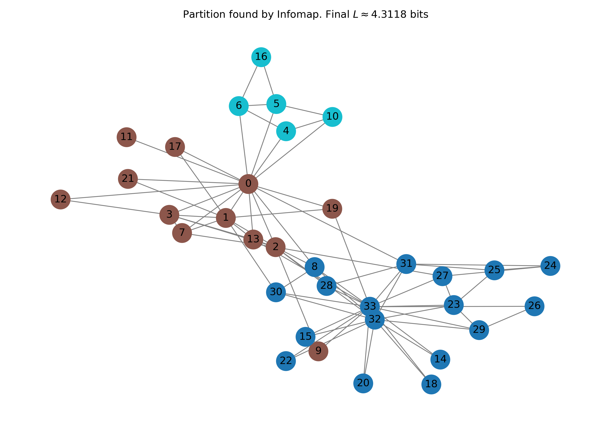
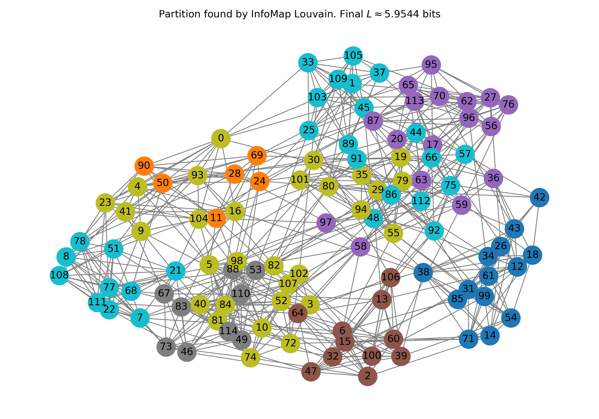
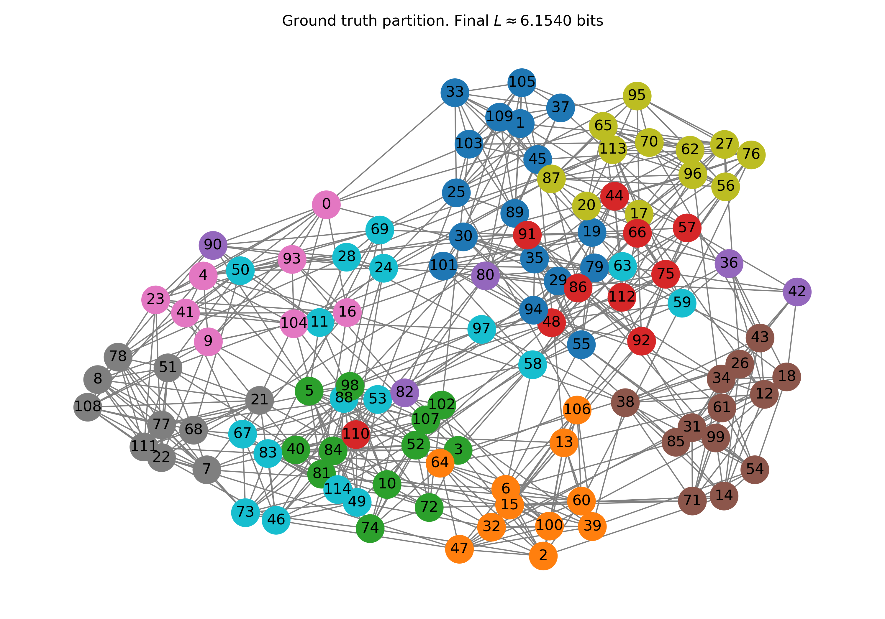
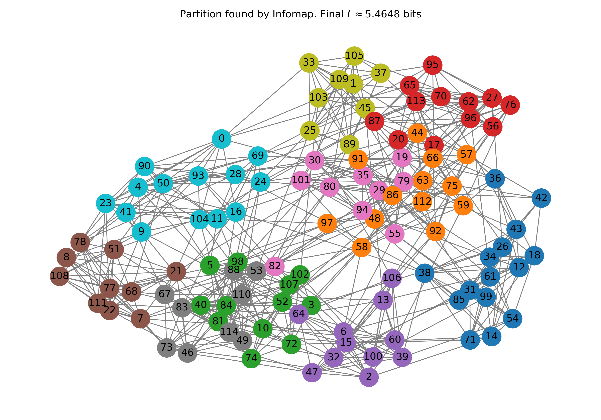

### Finding a good partition
* **NP-Hard Optimization:** Minimizing the Map Equation functional $L(B)$ is hindered by a highly non-convex energy landscape.
* **Intractable Brute-Force:** The partition space for $N$ nodes scales super-exponentially with the Bell number: 
  $$B(N) \approx e^{e^N - 1}$$. 

### The Louvain Heuristic (Blondel et al., 2008)
* **Greedy Strategy:** Efficiently navigates the landscape to identify high-quality local minima.
* **High Adaptability:** Originally designed to maximize Newman's modularity $Q$, but easily generalized to optimize any graph functional.

### How does it work?

Two distinct phases, repeated until the system reaches convergence. Call $L$ the objective function.

1.  **Local optimization (greedy phase):** Each node is assigned to a unique community. We then visit the nodes and evaluates, for each node $i$, the change in the function $L$ resulting from moving $i$ into the community of one of its neighbors. The node is transferred to the community that yields the max reduction in $L$. This relaxation process is iterated over all nodes until a stable local minimum is reached, where no further single move produces an energy gain. ===> We have reached a local minimum

2.  **Global aggregation:** A new graph is constructed in which the communities identified in the previous phase are collapsed into single "super-nodes". Links internal to the original communities are transformed into weighted *self-loops* on the super-node, while connections between nodes of different communities are aggregated to form weighted edges between the new super-nodes.

3. **Loop all over again**
   

### Zachary network

We will start our work with a simple network

This is useful: historically, this network comes with a natural partition in its nodes

### Map equation

Qua metterei la definizione della map equation, ma se ne hai gia parlato tu @Alessandro possiamo anche lasciar perdere

### Zachary network: trivial partition

Sempre immagine di prima:

Using the trivial partition (one module), we get a $L = 4.74$ bots. This means that we need approximately $4.74$ bits to describe the trajectory of a random walker on the graph, if we use the trivial partition

Note this is still smaller than the raw bit content of the graph, which is $5.09$ bits

### Zachary network: Louvain

### Zachary network: Louvain

Note that our algorithm is still stochastic, since we are traversing the node list in random order. We can repeat multiple times and see what we get:

### Zachary network: InfoMap

There exists an official implementation of the InfoMap algorithm, available at https://www.mapequation.org/. This C++ based library represents the state-of-the-art and is highly optimized both in terms of computational speed and stochastic search accuracy. 

Unlike simple greedy heuristics, it employs advanced optimization techniques to effectively explore the solution space and avoid local minima.

Notably, the official implementation revealed a 3-community structure with a description length L substantially lower than that found by our Louvain-based approach!

### Football network
Let's explore how this algorithm scale with a different and bigger network

### Comparing partitions

How can we compare the partitions found by Infomap and InfoMap Louvain against the ground truth? We can use metrics like NMI to quantify the similarity between the partitions. The NMI for two random variables $X$ and $Y$ is defined as:

$$
\text{NMI}(X, Y) = \frac{2 \cdot I(X: Y)}{H(X) + H(Y)}
$$

The idea is to interpret two partitions as random variables and then use the formalism of information theory. In particular, imagine we choose randomly one node in the graph. Then the random variable $X$ tells us to which partition the selected node belongs (according to the first partition) and similarly $Y$ with the second partition. 

hence, mutual information tells us how efficiently we can describe one partition if we already know the other. Specifically, it measures how much less information it takes to communicate the first labeling if we know the second versus if we do not.

The NMI value ranges from 0 to 1:
* **$\text{NMI} = 1$**: The two partitions are identical (perfect correlation). This means $H(X) = H(Y)$ and $I(X:Y) = H(X)$
* **$\text{NMI} \approx 0$**: The two partitions are independent (no correlation, hence $I(X:Y)=0$). 

This metric is particularly suitable for community detection because it is invariant to the permutation of cluster labels. It effectively measures the shared information regardless of whether the algorithm labels a group as "1" and the ground truth labels it as "A". 

### Comparing partitions with NMI

[qua sarebbe da racchiudere in una tabella o un ambiente math]

NMI (ground truth -- optimized InfoMap): 0.9114
NMI (ground truth -- Louvain): 0.9242
NMI (InfoMap -- Louvain): 0.9744

Note: InfoMap and Louvain are very close to each other, much more than with respect to the ground truth. 

### An even bigger network

Let's try with an even bigger network ($\approx 2000$ nodes). Here we obtain:

[Anche qui sarebbe da mettere in una o 4 tabelle]
- Time execution:
Infomap optimized: 0.06 seconds
InfoMap Louvain : 465.49 seconds (much slower)
- NMI comparison
NMI (ground truth -- optimized InfoMap): 0.4136
NMI (ground truth -- Louvain): 0.4082
NMI (InfoMap -- Louvain): 0.9289
- Final partition value:
Optimized InfoMap partition: 7.2332 bits
Ground truth partition: 10.1452 bits
Louvain partition: 7.2390 bits
- Number of identified comunities
Number of communities (Infomap): 277
Number of communities (Louvain): 293
Number of communities (Ground Truth): 7

Note that the ground truth here is not really a good partition (in the infomap sense!). Better partitions (lower $L$) can be found with a very large number of communities: indeed, InfoMap optimized and Louvain agree quite well with each other 